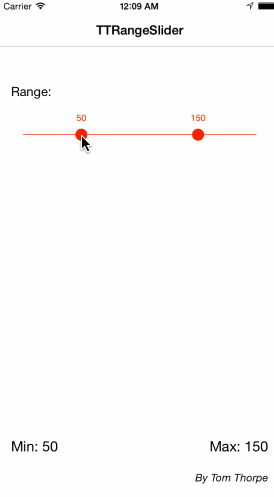
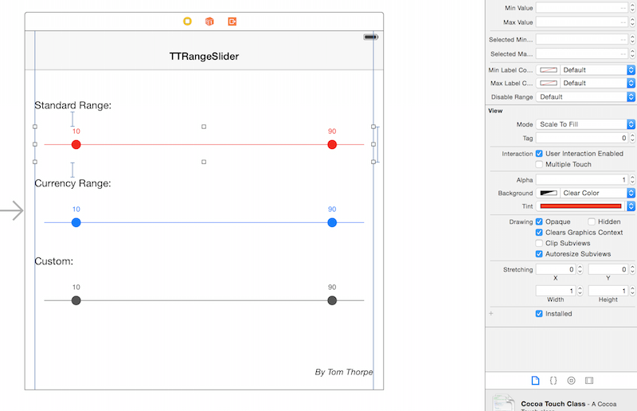

# TTRangeSlider
[](https://travis-ci.org/TomThorpe/TTRangeSlider) [](http://cocoadocs.org/docsets/TTRangeSlider)
[](http://cocoadocs.org/docsets/TTRangeSlider)
[](http://cocoadocs.org/docsets/TTRangeSlider)

A slider, similar in style to UISlider, but which allows you to pick a minimum and maximum range.


## Installation
TTRangeSlider is available through [CocoaPods](http://cocoapods.org). To install
it, simply add the following line to your Podfile:

```ruby
pod "TTRangeSlider"
```

Note that this control uses IB_DESIGNABLE, so for it to work well and not get warnings in Interface Builder, you should use the latest version of CocoaPods, and add the `use_frameworks!` line. So your podfile may look something like

```ruby
source ‘https://github.com/CocoaPods/Specs.git'
use_frameworks!

pod “TTRangeSlider”
```

## Usage

Add the TTRangeSlider like you would with any other UIControl. Either:
* Add a view in your storyboard/class and change it’s type to `TTRangeSlider`. As long as you’re using >= XCode6 you can now use this control like any other, you can set all the properties in the Attributes Inspector and see a live preview:



or
* Create the `TTRangeSlider` in code using `[TTRangeSlider alloc] init]` then add it as a subview to your code and set the relevant autolayout properties or frame.

The default slider ranges from 0->100 and has 10 preselected as the minimum, and 90 as the maximum. 

Values that the user has selected are exposed using the `selectedMinimum` and `selectedMaximum` properties. You can also use these properties to change the selected values programatically if you wish.

Other customisation of the control is done using the following properties:
#### `tintColor`
The tintColor property (which you can also set in Interface Builder) sets the overall colour of the control, including the colour of the line, the two handles, and the labels.

It is safe to change the `tintColor` at any time, if the control is currently visible the colour change will be animated into the new colour.
#### `tintColorBetweenHandles`
The tintColorBetweenHandles property sets the color of the line between the two handles.
#### `minValue`
The minimum possible value to select in the range
#### `maxValue`
The maximum possible value to select in the range
#### `selectedMinimum`
The preselected minumum value (note: This should be less than the selectedMaximum)
#### `selectedMaximum`
The preselected maximum value (note: This should be greater than the selectedMinimum)
#### `numberFormatterOverride`
Each handle in the slider has a label above it showing the current selected value. By default, this is displayed as a decimal format.
#### `hideLabels`
When set to `YES` the labesl above the slider controls will be hidden. Default is NO.
#### `minDistance`
The minimum distance the two selected slider values must be apart. -1 for no minimum. Default is -1.
#### `maxDistance`
The maximum distance the two selected slider values must be apart. -1 for no maximum. Default is -1.

You can override this default here by supplying your own NSNumberFormatter. For example, you could supply an NSNumberFormatter that has a currency style, or a prefix or suffix.

If this property is nil, the default decimal format will be used. Note: If you want no labels at all, set this value to be `(NSNumberFormatter *)[NSNull null]` (as opposed to nil), to specifically mark that you want no labels
#### `minLabelColour`
The colour of the minimum value text label. If not set, the default is the tintColor.
#### `maxLabelColour`
The colour of the maximum value text label. If not set, the default is the tintColor.
#### `disableRange`
If true, the control will mimic a normal slider and have only one handle rather than a range.

In this case, the selectedMinValue will be not functional anymore. Use selectedMaxValue instead to determine the value the user has selected.
#### `enableStep`
If true the control will snap to point at each `step` (property) between minValue and maxValue. Default value is disabled.
#### `step`
If `enableStep` is true, this controls the value of each step. E.g. if this value is 20, the control will snap to values 20,40,60...etc. Set this is you enable the `enableStep` property.
#### `handleImage`
If set the image passed will be used for the handles.
#### `handleColor`
If set it will update the color of the handles. Default is `tintColor`.
#### `handleDiameter`
If set it will update the size of the handles. Default is `16.0`.
#### `selectedHandleDiameterMultiplier`
If set it update the scaling factor of the handle when selected. Default is `1.7`. If you don't want any scaling, set it to `1.0`.
#### `lineHeight`
Set the height of the line. It will automatically round the corners. If not specified, the default value will be `1.0`.

## Author

Tom Thorpe

## License

TTRangeSlider is available under the MIT license. See the LICENSE file for more info.
